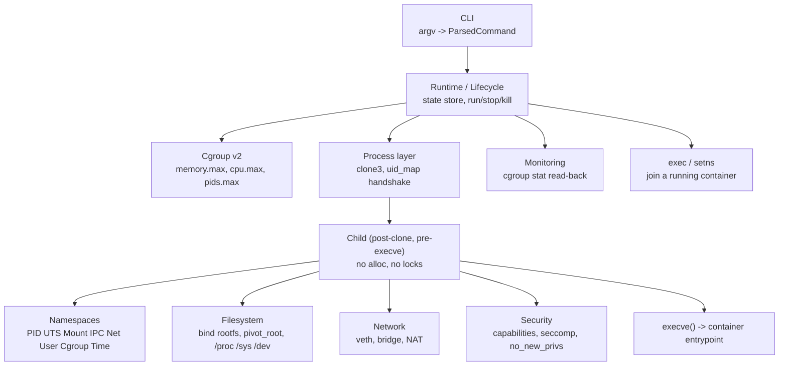

# MiniContainer

A from-scratch Linux container runtime written in C++20, built to learn how
containers actually work at the kernel level: namespaces, cgroups v2,
`clone3()`, capabilities, seccomp, and the mount/network plumbing that Docker
and runc hide behind a friendly CLI.

**This is an educational project, not a production container runtime.** It is
intentionally not OCI-compliant, has no image registry, and makes tradeoffs a
real runtime would not (see [Limitations](#limitations)). What it does aim for
is being *correct and honest* about the mechanisms it implements.

---

## Status

**Complete and working.** MiniContainer creates and runs containers. Verified
on Ubuntu 24.04 / WSL2, not merely asserted:

```
$ minicontainer run --rootfs ~/rootfs --hostname boxy --memory 64M /bin/sh -c '...'
hostname : boxy            # host is "Raghu": UTS namespace works
pid      : 2               # PID 1 is the init shim; the host shell was 269
processes: 5               # its own /proc, not the host's hundreds
root     : bin dev etc home lib lib64 proc root sbin sys tmp usr var
devices  : full null pts random tty urandom zero

$ cat /sys/fs/cgroup/minicontainer/<id>/memory.max     # read from the HOST
67108864                   # exactly the 64M that was asked for
```

Every subcommand is implemented. **285 tests pass**, the tree is warning-free
under `-Werror`, and it is clean under ASan + UBSan.

| Verified working | Implemented but unproven |
|---|---|
| `run`, `create`, `start`, `stop`, `kill`, `rm`, `logs` | Bridge networking (veth, NAT, `-p`) — only `--network none` has been run end to end |
| `ps`, `inspect`, `stats`, `version`, `help` | `exec` — joins namespaces and forks, but not yet exercised against a live container |
| PID / UTS / mount / IPC / network / user namespaces | `--seccomp=profile` from a file (returns `Op::Unsupported`; the built-in deny list works) |
| `pivot_root`, `/proc` `/sys` `/dev` `/dev/pts` `/tmp`, device nodes | |
| cgroup v2 memory, cpu, pids, cpuset limits | |
| Capability dropping, `no_new_privs`, seccomp deny list | |
| State persisted to `state.json`; exit codes forwarded | |

Not in scope, deliberately: OCI bundles, image layers, a registry, and
benchmark numbers. See [Limitations](#limitations).

The Status section above is authoritative.

---

## Requirements

MiniContainer needs real Linux namespaces and cgroups v2. On Windows that
means **WSL2**, not WSL1.

| Requirement | Verified against |
|---|---|
| Linux kernel with cgroup v2, user namespaces, seccomp | 6.18.33.2-microsoft-standard-WSL2 |
| Distro | Ubuntu 24.04.4 LTS |
| Compiler | GCC 13.3 (C++20) |
| Build system | CMake 3.28.3 + Ninja |
| Libraries | `libcap`, `libseccomp`, GoogleTest |

### One rule that is not optional

**The build tree must live on native ext4 (`~/mc-build`), never under
`/mnt/c`.** drvfs/9p cannot represent device nodes or Linux mode bits, so
`mknod` fails there and the build is drastically slower. Keeping the *source*
on `C:\` is fine — only the build directory matters.

`scripts/wsl-build.sh` refuses to build into a Windows drive mount, so this is
enforced rather than merely documented.

### Installing dependencies

```bash
apt-get update && apt-get install -y \
  build-essential g++ cmake ninja-build pkg-config \
  libcap-dev libseccomp-dev libgtest-dev libgmock-dev \
  iproute2 iptables clang-format git
```

---

## Quick start

From Windows PowerShell:

```powershell
wsl -d Ubuntu-24.04 -- bash /mnt/c/TRR/TRR/MiniContainer/scripts/wsl-build.sh
```

That configures into `~/mc-build`, builds every target, and runs the
unprivileged test suite. Then:

```bash
~/mc-build/minicontainer version
```

### Check your host first (recommended)

```bash
bash scripts/check-environment.sh
```

Probes 16 host capabilities — cgroup v2 delegation, user namespaces,
`pivot_root`, `mknod`, seccomp, veth/bridge creation, iptables backend,
filesystem types — and prints a PASS/WARN/FAIL table. It exits non-zero only
on a real FAIL. It creates nothing that outlives the script and never writes
to a live kernel knob; it reports what *would* need changing.

A typical WSL2 result is 15 PASS / 1 WARN, the warning being
`net.ipv4.ip_forward=0`. That only matters once bridge networking exists; fix
it then with `sysctl -w net.ipv4.ip_forward=1`.

---

## Building

### With the wrapper

```bash
scripts/wsl-build.sh              # Debug build + unprivileged tests
scripts/wsl-build.sh --release    # CMAKE_BUILD_TYPE=Release
scripts/wsl-build.sh --asan       # AddressSanitizer + UBSan
scripts/wsl-build.sh --tests-only # build test targets, then ctest
scripts/wsl-build.sh --clean      # wipe the build dir first
```

Override the build directory with `MC_BUILD_DIR` (must still be on ext4).

### By hand

```bash
cmake -S /mnt/c/TRR/TRR/MiniContainer -B ~/mc-build -G Ninja \
  -DCMAKE_BUILD_TYPE=Debug
cmake --build ~/mc-build -j"$(nproc)"
```

### Build options

| Option | Default | Effect |
|---|---|---|
| `MC_BUILD_TESTS` | `ON` | Build `mc_unit_tests` and `mc_integration_tests` |
| `MC_ENABLE_SECCOMP` | `ON` | Link libseccomp; falls back with a warning if absent |
| `MC_ENABLE_ASAN` | `OFF` | AddressSanitizer |
| `MC_ENABLE_UBSAN` | `OFF` | UndefinedBehaviorSanitizer |
| `MC_WERROR` | `OFF` | Add `-Werror` |

`MC_WERROR` defaults off so that one module's in-progress warning cannot block
another contributor's build. The tree is currently `-Werror`-clean, so
`-DMC_WERROR=ON` configures, builds, and passes — it is ready to be turned on
as a CI gate whenever you want it.

### Build targets

| Target | Output |
|---|---|
| `mc_child` | Static lib for post-`clone()` code, built `-fno-exceptions -fno-rtti` |
| `mc_core` | Static lib: everything else under `src/` except `main.cpp` |
| `minicontainer` | The CLI executable |
| `mc_unit_tests` | Unprivileged tests |
| `mc_integration_tests` | Privileged tests (labelled `root`) |

All source lists are `CONFIGURE_DEPENDS` globs, so **new `.cpp` files are
picked up automatically** — you never edit `CMakeLists.txt` to add a file.

---

## Testing

```bash
# 101 unprivileged tests — the same set GitHub CI runs
ctest --test-dir ~/mc-build --output-on-failure -LE root

# 8 privileged tests — real namespaces, needs root
ctest --test-dir ~/mc-build --output-on-failure -L root

# everything (109)
ctest --test-dir ~/mc-build --output-on-failure
```

Under WSL your default user is typically `root`, so the privileged tests just
run. Each one calls `GTEST_SKIP()` rather than failing when it cannot get what
it needs, so an unprivileged host reports skips, not failures.

Run a single test or suite directly:

```bash
~/mc-build/tests/mc_unit_tests --gtest_filter='CliRunTest.*'
~/mc-build/tests/mc_integration_tests --gtest_filter='InitShim.*'
```

### What the privileged tests actually prove

These are the ones worth reading — they exercise real kernel behaviour:

- A child is genuinely PID 1 inside a new PID namespace.
- A hostname change in a new UTS namespace does not leak to the host.
- `CLONE_PIDFD` yields a working pidfd and `signal_process()` signals through
  it — immune to the PID-reuse race.
- An unmapped uid in a new user namespace reads back as the *overflow uid*,
  which is exactly why the parent-writes-`uid_map` handshake has to exist.
- The init shim reaps a reparented orphan while still tracking its own child.
- The init shim forwards a signal to the tracked child's process group, so a
  SIGTERM aimed at container PID 1 actually terminates the entrypoint.
- A bad clone flag combination produces a cleanly decoded error, not a bare
  errno.

---

## Using the CLI

```bash
minicontainer [--log-level LEVEL] <command> [ARGS...]
minicontainer -h | --help
minicontainer -v | --version
```

`LEVEL` is one of `trace`, `debug`, `info`, `warn`, `error`, `off`. It can
also be set via the `MINICONTAINER_LOG` environment variable; the flag wins.

### Commands

| Command | Purpose |
|---|---|
| `run` | Create and start a container, wait for it, forward its exit code |
| `create` / `start` | Create without starting; start a created container |
| `stop` / `kill` | SIGTERM then SIGKILL after a timeout; send an arbitrary signal |
| `exec` | Run a command inside a live container (setns + fork) |
| `ps` / `inspect` / `stats` | List containers; full detail; live cgroup usage |
| `logs` | Replay a detached container's captured output (`-f` to follow) |
| `rm` | Remove a container and its cgroup, network and state |
| `version` / `help` | Version and build facts; usage |

### A worked example

```bash
# Build a rootfs on ext4 (never /mnt/c - see Limitations)
scripts/create-rootfs.sh ~/rootfs

# Run something, with a memory limit and a hostname
minicontainer run --rootfs ~/rootfs --hostname boxy --memory 64M   /bin/sh -c 'hostname; echo "I am pid $$"'

# The guest's exit code is forwarded, not swallowed
minicontainer run --rootfs ~/rootfs /bin/sh -c 'exit 42'; echo $?   # 42

# Detached, then inspect and tear down
minicontainer run -d --rootfs ~/rootfs --name web --memory 32M   /bin/sh -c 'while true; do sleep 1; done'
minicontainer ps
minicontainer stats web
minicontainer logs web
minicontainer inspect web
minicontainer stop web && minicontainer rm web
```

Mistakes are caught with suggestions rather than a stack trace:

```bash
minicontainer bogus
#  -> exit 2: unknown command 'bogus'; did you mean 'logs'?

minicontainer run --memry 256M ~/rootfs /bin/sh
#  -> exit 2: unknown flag '--memry'; did you mean '--memory'?

minicontainer run --rootfs /mnt/c/rootfs /bin/sh
#  -> exit 2: that filesystem cannot represent device nodes (drvfs/9p),
#     caught before anything is created rather than as a later mknod EPERM
```

### `run` / `create` flags

| Flag | Meaning |
|---|---|
| `--rootfs PATH` | Root filesystem; requires a command after it |
| `--name` / `--hostname` | Container identity |
| `--memory` / `--memory-swap` | `256M`, `1G`, `512k`, or plain bytes (1024-based) |
| `--cpus` / `--cpu-shares` | Fractional CPUs (`0.5` → `cpu.max` = `50000 100000`) |
| `--pids` / `--cpuset-cpus` | Process limit, CPU pinning |
| `--network` | `none` \| `bridge` \| `host` |
| `-p, --publish` | `8080:80` or `5353:53/udp`, repeatable |
| `--ip` / `--dns` | Address and resolvers |
| `-e, --env` | `KEY=VALUE`, repeatable |
| `-v, --volume` | `src:dst` or `src:dst:ro`, repeatable |
| `-w, --workdir` | Working directory |
| `--cap-add` / `--cap-drop` | Capabilities; `ALL` accepted |
| `--seccomp` / `--no-new-privs` / `--privileged` | Security posture |
| `--userns` / `--read-only` | User namespace, read-only rootfs |
| `-i` / `-t` / `-d` / `--rm` | Interactive, TTY, detach, remove on exit |

Short flags cluster (`-itd` = `-i -t -d`) and value-taking short flags accept
attached values (`-eKEY=VAL`, `-w/srv`).

**Flags after the entrypoint belong to the guest.** Parsing stops at the first
non-flag token, so `run --rootfs /r /bin/ls -it /proc` passes `-it` to `ls`
and does *not* request a TTY. Use `--` to end flag parsing explicitly.

### Exit codes

| Code | Meaning |
|---|---|
| `0` | Success |
| `1` | The operation was attempted and failed |
| `2` | Command line or configuration rejected (usage error) |
| `3` | The host kernel cannot do what was asked — an error carrying `Op::Unsupported`, such as an undelegated cgroup controller |
| `128+n` | The container's entrypoint was killed by signal `n` |

A container that exits non-zero is **not** a MiniContainer failure: `run`
forwards the entrypoint's own status, so codes 1–127 out of a successful `run`
belong to the guest process.

Observed, so these are not aspirational:

```
minicontainer version                                    -> 0
minicontainer stop nosuch                                -> 1   (ran, failed)
minicontainer bogus                                      -> 2   (usage)
minicontainer run --rootfs ~/rootfs /bin/sh -c 'exit 42' -> 42  (the guest's)
```

Code `90` used to mean "parsed, but not implemented yet". Every verb is
implemented now, so nothing returns it — but it is left reserved rather than
recycled, because a script that learned to treat 90 as "missing feature" must
not start seeing it mean something else.

---

## Metrics

Measured on Ubuntu 24.04.4 / WSL2 kernel 6.18.33.2, GCC 13.3, Ninja, `-j8`.

### Code size

| Category | Lines |
|---|---:|
| Headers (`include/minicontainer/`, 11 files) | 2,021 |
| Implementation (`src/`, 29 files) | 9,432 |
| Tests (`tests/`, 10 files) | 4,878 |
| **Total C++** | **16,331** |

Test-to-implementation ratio: **1 : 1.9**.

### Tests

| Metric | Value |
|---|---:|
| Total tests | 285 |
| Unprivileged (`-LE root`) | 270 |
| Privileged (`-L root`) | 15 |
| Failures | 0 |

The privileged suite creates real namespaces, real cgroups and real processes.
It runs locally, never in GitHub CI — that runner is unprivileged, and
pretending otherwise would be worse than the honest gap.

### Quality gates

| Gate | Result |
|---|---|
| Debug build | 0 warnings, 285/285 pass |
| ASan + UBSan | 0 warnings, 285/285 pass, no sanitizer reports |
| `-DMC_WERROR=ON` (`-Wall -Wextra -Wpedantic -Wshadow -Wconversion`) | 0 warnings, 285/285 pass |
| `clang-format --Werror`, whole tree | Clean |
| `scripts/check-child-purity.sh` | Pass |
| End-to-end container creation | Verified |

All six run in CI except the last two categories of privileged test.

---

## Architecture



Three design decisions shape everything else:

**`clone3()`, not `fork()` + `unshare()`.** `unshare(CLONE_NEWPID)` does not
move the caller into the new PID namespace — only its future children — so you
would need a second fork with a half-configured process in between. `clone3()`
creates the process directly in every requested namespace atomically, and it
alone offers `CLONE_INTO_CGROUP` (no window where the child runs unconfined)
and `CLONE_PIDFD` (no PID-reuse race when signalling).

**The parent/child split is enforced, not merely intended.** Between `clone()`
and `execve()` the child may hold a malloc lock inherited from a thread that no
longer exists in its address space, so a single allocation can deadlock
forever. Child-side code therefore uses a no-allocation error type
(`ChildStatus`) and an async-signal-safe log sink that does one `write(2)`, and
`mc_child` is a separate CMake target built `-fno-exceptions -fno-rtti` so the
compiler enforces part of the split, and `scripts/check-child-purity.sh` runs
in CI to enforce the rest: it extracts every `step_*` body and rejects
`std::string`, `std::vector`, `new`, `malloc`, `snprintf`, `throw` and the
parent-side logging macros. It checks function bodies rather than whole files
because several translation units legitimately hold both halves - resolving a
capability name allocates freely, applying the resulting mask must not.

**Parsing is pure.** `parse_args()` makes no syscalls beyond reading argv, so
the entire CLI and all of configuration validation are unit-testable without
root. That is why 101 of 109 tests need no privileges at all.

Full tier structure and the reason for every dependency edge is in
`docs/dependency-graph.md`.

---

## Repository layout

```
include/minicontainer/   Frozen Tier-0 headers (errors, logging, config,
                         syscall, process, cli)
src/core/                errors, logging, config, syscall implementations
src/cli/                 parser.cpp, commands.cpp, main.cpp
src/process/             clone3, fd/pipe RAII, init shim, setns, wait
src/child/               post-clone code (empty — Wave 2)
src/{namespace,filesystem,cgroup,network,security,runtime}/
                         empty — Wave 2 and beyond
tests/unit/              Unprivileged GoogleTest suites
tests/integration/       Privileged suites (ctest label "root")
scripts/                 wsl-build, check-environment, create-rootfs, cleanup
docs/                    Per-mechanism teaching docs + feature matrix
cmake/                   Warning and sanitizer helper modules
```

---

## Feature matrix (summary)

| Area | Status |
|---|---|
| Tier-0 foundation (errors, logging, config, syscall wrappers, JSON) | Done |
| CLI parsing / dispatch | Done |
| Process layer (`clone3`, uid_map handshake, init shim, pidfd) | Done |
| Namespaces (PID, UTS, mount, IPC, net, user) | Done — cgroup and time namespaces unused |
| Filesystem (`pivot_root`, mounts, device nodes, bind mounts) | Done |
| Cgroups v2 (limits, delegation probing, stats) | Done |
| Security (capabilities, seccomp deny list, `no_new_privs`) | Done |
| Lifecycle (`run`/`stop`/`kill`/`ps`/`inspect`/`stats`/`logs`/`rm`) | Done |
| Networking (veth, bridge, NAT, WSL2 port publish) | Partial — implemented, only `--network none` proven |
| `exec` (setns into a live container) | Partial — implemented, not yet exercised |
| Seccomp profiles loaded from a file | Planned |
| OCI bundles, image layers, benchmarking | Planned — out of scope for now |

Full detail in `docs/feature-matrix.md`.

---

## Development workflow

Match what CI enforces before pushing:

```bash
# Formatting — CI runs clang-format --Werror on every C++ file
clang-format --dry-run --Werror $(find include src tests -name '*.cpp' -o -name '*.h')

# Fix in place
clang-format -i $(find include src tests -name '*.cpp' -o -name '*.h')

# Build + unprivileged tests, exactly as CI does
cmake --build ~/mc-build -j"$(nproc)"
ctest --test-dir ~/mc-build --output-on-failure -LE root
```

CI (`.github/workflows/ci.yml`) runs unprivileged on `ubuntu-latest`: it
builds everything and runs `ctest -LE root`. Privileged coverage is local
only — the runner cannot provide it, and pretending otherwise would be worse
than the honest gap.

Adding a file needs no build-system change; the globs pick it up. Adding a
test suite likewise — drop it in `tests/unit/` or `tests/integration/`.

Keep commits scoped, run the format and test gates above before pushing, and prefer small PRs over large ones.

---

## Limitations

These are deliberate, not bugs to file:

- **Not OCI-compliant.** No image format, no registry, no `config.json`
  bundle spec beyond a minimal path. You supply a rootfs directory.
- **Linux only, GCC/Clang only.** The error-propagation macros use statement
  expressions, a documented and intentional compiler extension.
- **No image layers.** No overlayfs, no content-addressed storage, no pull.
- **Single host.** No orchestration, scheduling, or clustering.
- **cgroup delegation is probed, never assumed.** `cgroup.subtree_control` is
  populated on the Ubuntu WSL distro (systemd running) and *empty* on
  docker-desktop's. Code must check at runtime — see `docs/cgroups.md`.
- **WSL2 networking differs from native Linux.** Port publishing needs
  `netsh portproxy` on the Windows side; see `docs/networking.md`.
- **No benchmark numbers yet.** Publishing startup-time or overhead figures
  before `run` works would be fiction. Benchmarking against Docker as a
  baseline is planned once there is something to measure.

---

## Documentation

| Document | Contents |
|---|---|
| `docs/feature-matrix.md` | Per-feature Done/Partial/Planned table |
| `docs/architecture.md` | Module structure and the error/logging model |
| `docs/dependency-graph.md` | Tier structure and why each edge exists |
| `docs/getting-started.md` | Full WSL2 setup walkthrough |
| `docs/namespaces.md` | The 8 namespace types and their failure modes |
| `docs/filesystem.md` | `pivot_root`, mount propagation, device nodes |
| `docs/cgroups.md` | cgroup v2, delegation, limit semantics |
| `docs/networking.md` | veth, bridge, NAT, WSL2 specifics |
| `include/minicontainer/security.h` | Capabilities, seccomp, `no_new_privs`, user namespaces — design commentary in the header |

---

## Roadmap

The runtime is feature-complete for what it set out to do. What remains is
proving and extending it:

1. **Exercise bridge networking end to end** and fix what that turns up — it
   is the largest piece of code with no runtime evidence behind it.
2. **Exercise `exec`** against a live container.
3. **Seccomp profiles from a file** (`--seccomp=profile`).
4. **Benchmark against `runc`**, following `docs/benchmarking.md`'s
   methodology. Not against Docker: that comparison is not like-for-like, and
   the document explains why.
5. Minimal OCI bundle support, if the project ever wants to run images other
   people built.
