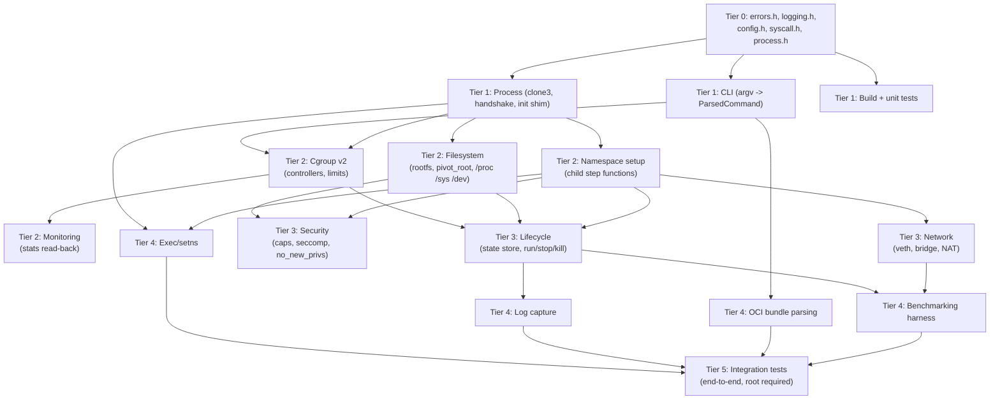

# Module Dependency Graph

This document explains the build order for MiniContainer's modules: which
tier depends on which, and *why* each edge exists. It mirrors the directory
layout under `src/` (`cli`, `process`, `namespace`, `filesystem`, `cgroup`,
`network`, `security`, `container`, `child`, `runtime`, `monitoring`,
`logging`) and the module boundaries implied by the Tier-0 headers.

## Why tiers, not a free-for-all

A container runtime has a genuine dependency order: you cannot write a
cgroup limit for a process that does not exist yet, and you cannot join a
mount namespace before `clone3()` has created one. Tiers make that order
explicit so parallel contributors know what they can build against today
(a frozen header) versus what they must wait for (another tier's
implementation).

## Tier 0 — Frozen foundation

`include/minicontainer/{errors,logging,config,syscall,process}.h`

Everything else compiles against these five headers. They define: the error
model (`Expected<T>`/`Error` for the parent, `ChildStatus`/`ChildErrorWire`
for the allocation-free child path), the logging split (`MC_LOG_*` vs
`MC_CLOG*`), the container specification (`ContainerConfig` and friends),
syscall flag-decoding/file helpers, and the process primitives (`Fd`,
`Pipe`, `clone_process()`, `run_init_shim()`, `open_namespace`/
`join_namespace`).

**Status:** Done — interfaces frozen and implemented in `src/core/` and
`src/process/`, covered by tests. See the README's Status section.

## Tier 1 — CLI, process, build, tests

Depends on Tier 0 only.

- **CLI** (`src/cli/`): `parse_command_line()`/`parse_args()` turn argv into
  a `ParsedCommand` containing a validated `ContainerConfig`. Pure — no
  syscalls beyond reading argv — which is what makes it unit-testable
  without root (`cli.h`'s own commentary is explicit about this).
- **Process** (`src/process/`): implements `clone_process()`, the
  parent/child uid_map handshake, `run_init_shim()`, `open_namespace()`/
  `join_namespace()`.
- **Build system**: CMake target `mc_core` compiling Tier 0 + Tier 1;
  GoogleTest wiring for the unit suite.
- **Tests**: the unprivileged unit suite (config validation, CLI parsing,
  flag formatting) — everything that needs no root and no namespace.

**Why this tier can start immediately:** nothing here requires a namespace,
a cgroup, or root privilege to *compile and unit-test*. `clone_process()`
needs root/`CAP_SYS_ADMIN` to *run successfully*, but its argument
validation and the CLI parser do not.

## Tier 2 — Namespace / filesystem / cgroup / monitoring

Depends on Tier 1's process layer (`clone_process()` must exist and work)
plus Tier 0's config.

### Why each Tier-2 edge exists

- **Process -> Namespace setup**: the child-side step table (`ChildSetup`,
  `SetHostname`, `MakeRootPrivate`, ... through `Execve` in the `Op` enum in
  `errors.h`) runs *inside* the process `clone_process()` creates, after the
  sync-pipe handshake wakes the child. There is no child to set up namespaces
  in until the process layer can create one.
- **Process -> Filesystem**: `pivot_root` and the `/proc`/`/sys`/`/dev`
  mounts happen inside the same post-clone child, for the same reason.
- **CLI + Process -> Cgroup**: cgroup creation needs a `ContainerConfig`
  (parsed by the CLI) to know the resource limits, and `CLONE_INTO_CGROUP`
  needs the process layer to pass `cgroup_fd` through `CloneRequest` — the
  cgroup must exist *before* `clone3()` is called so the child is born
  inside it (see `process.h`'s commentary on why this matters: it closes
  the window where an unconfined child could exceed its memory limit before
  being attached).
- **Cgroup -> Monitoring**: reading `memory.current`, `cpu.stat`, etc. only
  makes sense once a cgroup has been created and a process attached to it.

## Tier 3 — Network / security / lifecycle

- **Namespace -> Network**: veth pair creation and moving the peer into the
  container's netns requires the netns to already exist (created as part of
  namespace setup).
- **Filesystem + Namespace -> Security**: capability dropping and seccomp
  installation happen late in the child step table, after the mount
  namespace is set up and `pivot_root` has completed — you drop privilege
  *after* you've used it to do privileged setup, never before.
- **Cgroup + Filesystem + Namespace -> Lifecycle**: the state store
  (`run`/`stop`/`kill`/`ps`) needs to know about cgroups (for `stats`/
  cleanup), the rootfs (for validation), and namespaces (for `exec`/setns)
  to have anything meaningful to persist in `state.json`.

## Tier 4 — Exec/setns, logs, OCI, benchmarks

- **Exec** (`minicontainer exec`) needs `open_namespace()`/
  `join_namespace()` from the process layer and a running container's
  namespaces to join.
- **Log capture** needs the lifecycle/state layer to know where a
  container's stdout/stderr are being redirected.
- **OCI bundle parsing** only needs the CLI layer (it produces a
  `ContainerConfig`, same as the flag-based parser) but is placed late
  because it is not needed for the core teaching path.
- **Benchmarking** needs a working `run` (lifecycle) and, for comparison,
  working networking (some benchmark scenarios stress veth/NAT throughput).

## Tier 5 — Integration

End-to-end tests that actually create namespaces, cgroups, and network
interfaces, and require root. These can only be meaningful once every tier
below them has real (not just declared) implementations — there is nothing
to integration-test yet.
